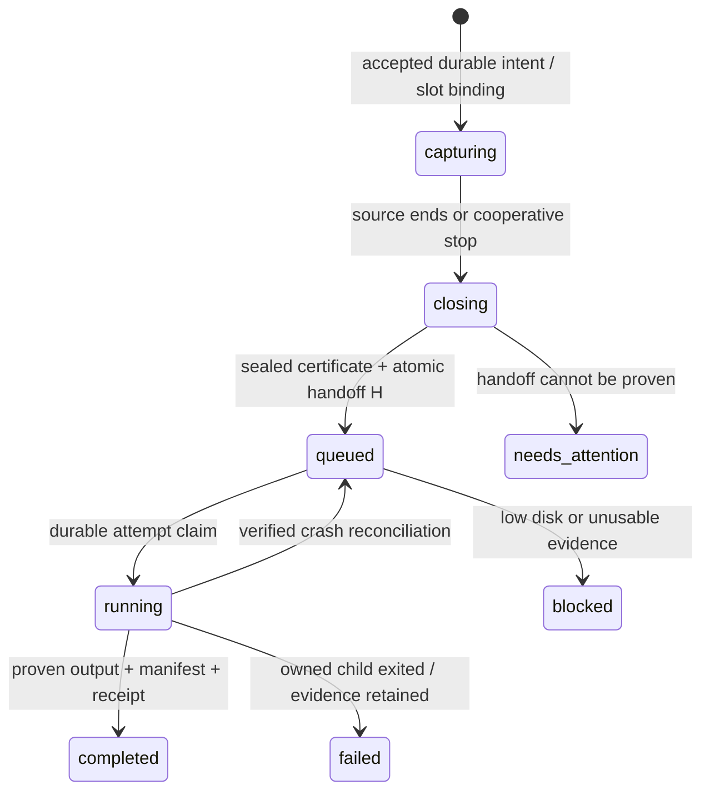

# Issue #52 — capture availability and durable local finalization

## Current guarded-publication contract — 2026-10-06

[PM decision 6010639470](https://github.com/lvrdnck/TikREC/issues/52#issuecomment-6010639470)
accepts `1e1e1cae` candidate validation, preserving accepted R1–R10/assembly.
The [publication contract/evidence](ISSUE_52_GUARDED_PUBLICATION.md) connects the
original one-shot coordinator and continuously protected candidate to its exact
claimed MP4 destination. Original acquisition narrowly adds candidate DELETE
rights; only publication-capable validation uses read-only inherited seekable
stdin. Assembly-only/validation-only defaults and arbitrary-launch refusal remain.
Schema **7** appends immutable preparation and separate observed-result evidence;
schemas **1–6 are refused/preserved unchanged**, no migration/cutover. Preparation
is not completion; native root-relative no-replace rename has no reopen/replay.
The exact local scratch-to-output successor retains all ownership. Original
assembly/candidate/validation evidence, pending manifests, accounting/claims/pins
and synchronous CLI/service defaults remain. No settlement/refund, retry/adoption,
service/production integration or release. #52 OPEN/SINGLE ACTIVE; #48 OPEN/PAUSED;
#28 unresolved. Earlier checkpoints below are historical within their limits.

## Historical accepted candidate-validation contract — 2026-10-05

[PM decision 6000035417](https://github.com/lvrdnck/TikREC/issues/52#issuecomment-6000035417) accepts `ee884bdc` connected assembly and supersedes its pending-review
checkpoint. The new [validation contract/evidence](ISSUE_52_CANDIDATE_VALIDATION.md) describes `JournalValidation`: exact same-attempt
validation with original native/input ownership retained, three fixed durable
contained FFprobe phases, append-only evidence and no arbitrary post-candidate
launches. Schema 6 adds validation authority/receipts; schemas 1–5 are refused and
preserved without migration. Assembly/candidate evidence remains immutable
`not_checked / unpublished`; separate validation success does not publish, settle,
release units/claims/pins or permit retry/adoption. Pending manifests are unchanged.
Only explicit candidate validation joins the writer's cancellation-aware long
execution allowance; generic readers remain finite, with bounded final drain/
cancel/cleanup. Failure/ambiguity and unknown lifetime retain native protection.
#52 OPEN/SINGLE ACTIVE; #48 OPEN/PAUSED; #28 unresolved. Delivery stops for PM
review; no service/production/cutover/release action. The checkpoints below are
historical accepted evidence within their recorded limits.

## Historical accepted internal journal-backed assembly — 2026-10-05

[PM decision 5999162236](https://github.com/lvrdnck/TikREC/issues/52#issuecomment-5999162236)
accepts `58e40084` and authorizes one internal adapter only. This supersedes the
pending-review/no-successor statements for scratch; accepted foundations remain
accepted. `JournalAssembly` requires explicit held authority and claims at most
one FIFO sealed session through its `AttemptCoordinator`. Its exact original-H
inputs stay protected throughout shared planning, durable probes, one contained
writer and same-attempt unpublished/not_checked MP4 sealing.

Scratch owns exclusive directory creation; there is no call to standalone
`UnpublishedAssembly._prepare()`, independent owner or supervisor helper write.
Copy binds trusted `-I -c` launcher code, concat text and exact FFmpeg argv in one
writer intent. That already-contained writer exclusively creates/fsyncs
`concat.ffconcat`; FFmpeg inherits its job and diagnostic pipes. Wrapper exit
alone is insufficient. Reencode directly uses the shared exact command. Empty
inventory/single-writer, R8 owner/failure retention, R9 truthful cleanup and R10
complete artifact/inventory rechecks remain intact, without a schema-5 change.

Only declared writers may wait without an overall deadline. Cancellation-aware
polling is outside authority/SQLite/resume locks; final EOF/cancel/cleanup retain
separate bounded operations. Optional trusted `on_exit` interpretation finishes
semantic diagnostics before success without skipping independent exit/cleanup.
Zero-exit explicit FFmpeg failures refuse sealing; degraded/unknown input facts
are preserved, with no #28 repair or runtime media-validation claim.

Final tree: **129 focused passed; 651 related passed / 2 skips; 2,389 full passed /
9 skips / 19 subtests passed**, no failures. Delivered for PM review. Both NEW connected
generated media paths preserve hashes/frame timing and pass part/DTS/deep-output
checks; the unchanged pending-manifest validator mismatch is recorded explicitly.
Twelve actual connected supervisor-death boundaries and integrated cancellation/
descendant/unknown-status/diagnostic/cleanup/ack-loss cases pass. No atomic namespace/
SQLite snapshot, power-loss, natural-recording or full A1–A20/service gate is claimed.
The task remains unfinished/running and counted with durable ownership/pins.
See [integration contract/evidence](ISSUE_52_JOURNAL_ASSEMBLY.md). #52 stays OPEN/SINGLE
ACTIVE; #48 OPEN/PAUSED, #28 unresolved. Next: PM review; no publication, settlement,
retry/adoption, scheduler/service/production/retention/migration/dependency/merge/
release work. Owner decisions: None; `Refs #52`, preserve pushed history.

## Historical scratch corrections R8–R10 — accepted by 5999162236

[PM review 5993102551](https://github.com/lvrdnck/TikREC/issues/52#issuecomment-5993102551)
requires R8–R10 before accepting the scratch slice for successor integration.
The current task preserves first failures and explicit partial native owners,
reports retained scratch protection as incomplete cleanup, and revalidates the
whole inventory plus all held artifact evidence before binding/sealing. Real
supervisor-death and scratch-writer cancellation/descendant/diagnostic/cleanup
checks supplement the original exception tests. Schema 5 and accepted R1–R7
foundations remain intact. Final tree: **71 focused passed; 593 related passed /
2 skips; 2,339 full passed / 9 skips / 19 subtests**, with no failures. Current
status: corrections delivered for PM review; no successor integration authorized.
Owner decisions: None. See [current evidence and limits](ISSUE_52_DURABLE_SCRATCH.md).

## Historical first scratch delivery — correction review required

[PM scope decision](https://github.com/lvrdnck/TikREC/issues/52#issuecomment-5991952747)
narrows the next implementation slice to durable attempt scratch and unpublished
candidate ownership, bound to `AttemptCoordinator`. This supersedes the earlier
queue-connected assembly selection: do not connect the queue to MP4 assembly in
this slice. The implementation records a durable reservation before native
workspace creation, then binds the workspace identity and declared artifact
observations to the exact attempt/session/H-seal/writer operation. A writer may
only write declared outputs through a separate authority. Candidate evidence is
sealed only after complete writer-exit and cleanup proof, with validation
`not_checked` and publication `unpublished`. Ambiguous artifacts and native
handles remain held; journal reopen is inspection only and cannot adopt a process
or workspace. Schema 5 is new; schemas 1–4 remain unchanged and are refused
without migration. This does not add validation, publication, queue settlement,
retry, scheduling, service integration, or full A1–A20 acceptance. See
[durable scratch evidence and limits](ISSUE_52_DURABLE_SCRATCH.md).

**Historical status:** delivered for PM review; R8–R10 were subsequently required.
Issue #52 remains OPEN/SINGLE ACTIVE. No integration or production changes.

## Historical durable attempt/launch checkpoint - 2026-10-04

[PM review 5982869804](https://github.com/lvrdnck/TikREC/issues/52#issuecomment-5982869804)
**accepted `44711e65`** and selected durable attempt/child launch with claimed
input protection. The isolated one-shot `AttemptCoordinator` now combines existing
FIFO/single-finalizer claiming, distinct claimed protection and sequential
creation-contained readers. Original H/marker evidence is separate from current
task/owner revisions. Approved schema **4** adds permanent intent/native identity/
whole-job exit/diagnostic/cleanup records; schemas 1/2/3 are retained/refused
unchanged, without migration. Final resume fencing serializes cancellation/
revocation with exact native resume. Unknown/unclean owners retain reachable input
guards; historical receipts do not authorize creation, resume or adoption.
Successful readers leave unfinished tasks held with counted units/raw/room/path
pins while disjoint capture retains both slots. No scratch protocol, queued MP4
assembly, publication/settlement/retry or service integration.
Final **484 focused / two skips; 1,281 related / six skips / two subtests;
2,270 full / nine skips / 19 subtests passed**. Ten native owner-death boundaries,
final diagnostic tails, claimed teardown faults and bounded sequential FFprobe
on actual sealed H inputs pass; evidence hashes stay unchanged. Both separate
generated assembly paths retain part/packet-DTS/deep validation and absent final
destinations. [Complete evidence and limits](ISSUE_52_DURABLE_LAUNCH.md).
**Historical next action (2026-10-04): PM review of that slice; superseded by
the 2026-10-05 decision above.**
#52 OPEN/SINGLE ACTIVE, #48 OPEN/PAUSED (Gracie-only raw/Ward OFF), #28 unresolved;
owner decisions: None. Scratch/publication/settlement/retry, scheduling/service/
retention/migration/cutover and full A1-A20/Scheduled Task acceptance remain gates.
No production access/change/restart, retention execution, #48 polling, resource
policy/upgrade/release/tag/remote worker/merge.

## Historical sealed-input checkpoint - accepted by 5982869804

2026-10-04: [review 5981877279](https://github.com/lvrdnck/TikREC/issues/52#issuecomment-5981877279)
**accepted `2d6896ce` and `c22c482f` unpublished assembly**, selecting only native
sealed-input protection. `acquire_sealed_inputs` now addresses an explicit known
authority/session/revision/seal and atomically reads original queued H ownership,
immutable claims and receipt. Distinct noninheritable read-compatible handles
deny data-write/delete sharing, hold all FLV/raw/arrival/control/marker evidence
and compare native identity/size/write stamps plus stored control hashes. Marker
validation uses actual schema-3 intent/seal/catalog/H bindings; its byte hash is
only a lease-local snapshot. Capture zero-sharing closure is unchanged.

Compatible existing root writer protection permits disjoint capture without a
capture slot/unit. Native evidence work is outside authority/SQLite locks;
target projection and complete inventory are rechecked around acquisition/use.
Original and secondary failures retain possibly live exact owners. Final reader
exit and revalidation are the future orchestrator's responsibility; there is no
task claim, launch write, scratch allocation, queue assembly or guard-to-assembly
wiring here. [Actual native read evidence and limits](ISSUE_52_SEALED_INPUTS.md).
This adds partial A7/A8 evidence only, no full A1–A20 or Scheduled Task acceptance.
Durable attempts/launch, claimed-phase input/scratch protocols, validation/
publication/settlement/retry and service/retention/cutover remain later gates.
Final **434 focused / 1,365 related / 2,220 full passes**; full nine skips /
19 subtests passed. Actual H raw/arrival/control fixtures, bounded owned FFprobe,
unchanged hashes and both assembly/media regression paths pass. The introduced
R5 receipt-lookup ordering regression was fixed and all selections rerun.
**Historical next action: guard review, completed by 5982869804.**
#52 remains OPEN/SINGLE ACTIVE; #48 paused; owner decisions: None.

The following assembly checkpoint is historical and accepted by 5981877279.

2026-10-04: [review 5980268720](https://github.com/lvrdnck/TikREC/issues/52#issuecomment-5980268720)
**accepted `b2bff05f` R6–R7** and selected only explicit closed FLVs -> an
attempt-owned unpublished MP4 candidate. That internal primitive is implemented
on the isolated branch, sharing existing ordering/AVC/copy/libx264/filter/frame-rate/
timing/quality/diagnostic logic with the unchanged synchronous finalizer. Every
required probe/assembly child uses the contained owner and fresh before-resume
authorization. Exclusive fresh scratch and post-authorization collision checks
preserve candidates/partials; no path promotion, manifest/control mutation,
publication receipt, journal settlement or capacity refund occurs.

Whole-job exit, complete bounded streaming diagnostics/EOF, cleanup and nonempty
candidate evidence establish execution readiness only. Input-decode health,
validation and publication stay distinct; degraded reencode evidence is retained.
Unknown native lifetime leaves the owner reachable and forbids a successor.
Cancellation/first-error/secondary-cleanup evidence survives final draining;
running assembly has no blanket thirty-second limit or new watchdog policy.
The installed FFmpeg's occupied-output exit-0 behavior is explicitly fenced.

[Actual assembly evidence and trusted preconditions](ISSUE_52_UNPUBLISHED_ASSEMBLY.md):
**198 focused / 1,222 related / 2,162 full passes**, both generated AVC paths,
part/packet-DTS/deep validation, unchanged source/raw/arrival/control fixture
hashes, matching synchronous frame timing and absent final destinations.
R4–R7/schema-3/history/refusal/FIFO/eight-unit accounting remain intact. This
primitive trusts closed inputs and exclusive caller scratch; durable attempts/
launch persistence, integration of the separate sealed-input guard, queue scheduling, validation/
publication/settlement/retry and service/retention/migration/cutover remain later
reviewed adapters. No full A1–A20 or deployed Scheduled Task gate passed.
#52 OPEN/SINGLE ACTIVE; #48 paused; #28 unresolved; owner decisions: None.
**Historical next: primitive review, completed by 5981877279.** Earlier checkpoints
below are historical; no production access/change, release/tag or merge occurred.

2026-10-04: [review 5979948212](https://github.com/lvrdnck/TikREC/issues/52#issuecomment-5979948212)
retained `86b9d4d4` containment and required only R6–R7 before integration.
Those corrections now fence validation/allocation/resume against irreversible
close/cancel intent and reconcile final stdout/stderr EOF separately from proved
whole-job exit. Bounded pending/incomplete stream evidence preserves tail bytes,
prefix/drop accounting and first-error diagnostics. Baseline **14 failed / three
controls passed**; corrected focused **91 passed**; related **675 passed / two
skips**; full isolated **2,115 passed / seven skips / 19 subtests passed**.
[Actual correction evidence and unchanged gates](ISSUE_52_PROCESS_LIFETIME.md).
R4–R5 remain accepted; schema 3, containment and synchronous defaults unchanged.
No full A1–A20 or deployed Scheduled Task acceptance is inferred. #52 stays
OPEN/SINGLE ACTIVE; #48 paused; #28 unresolved. Next is correction review, not
automatic integration. Earlier checkpoints below describe historical delivery.

2026-10-04: [review 5979465363](https://github.com/lvrdnck/TikREC/issues/52#issuecomment-5979465363)
**accepted `3d26a7bc` R4–R5** and selected the isolated Windows subprocess owner.
That process boundary is implemented for review on the same isolated branch:
single-use session/attempt UUID, creation-time JOB_LIST containment, suspended
authorization, exact handles/creation identity, bounded streams/cancellation and
native whole-job exit evidence. Synchronous defaults and schema 3 are unchanged.
[Actual native/media tests, support limits and partial A6/A12/A19 evidence](ISSUE_52_PROCESS_LIFETIME.md).
No worker, queued assembly/publication, settlement, service wiring or cutover is
implemented; no full A1–A20 service gate is passed. #52 remains OPEN/SINGLE ACTIVE,
#48 OPEN/PAUSED, #28 unresolved. Next is project-manager review of this slice;
no owner product decision is pending. The earlier checkpoints below are historical.

2026-10-04: **focused R4–R5 corrections complete for review on the isolated bridge.**
[Review 5978780261](https://github.com/lvrdnck/TikREC/issues/52#issuecomment-5978780261)
retains `ea263199` but requires an explicit confirmed-H cleanup boundary and exact
marker disposition before another review. The corrections preserve committed
task/evidence ownership after native teardown failure, independently release the
capture lease and return post-H diagnostics. Marker disposition must be exactly
`assembly` / `empty` and agree with the stored seal before receipt lookup.
Baseline **17 failed**; corrected focused **228 passed**, related **1,221 passed /
six skips / two subtests**, full isolated **2,024 passed / seven skips / 19 subtests**.
Actual results and unchanged proof limits are in the bridge report below.

The initial isolated capture-only close -> durable H bridge was complete for review.
[Review 5971119601](https://github.com/lvrdnck/TikREC/issues/52#issuecomment-5971119601)
accepted `a96bd6e9` R1–R3 and selected this single capture-side integration slice.
[Bridge implementation, native proof limits, actual tests and A1–A20 coverage](ISSUE_52_CAPTURE_HANDOFF.md).
Journal schema 3 adds pinned admitted-empty evidence; schemas 1/2 are preserved/refused.
Production wiring, finalizer/process policy, publication, recovery/cutover and the
full service gates remain unimplemented. The review history below is historical.

2026-10-03: **focused journal corrections complete for review; service integration NOT approved.**
[Review 5970692341](https://github.com/lvrdnck/TikREC/issues/52#issuecomment-5970692341)
retains `58939620` as the isolated foundation but requires R1 stop/admission,
R2 cross-owner/automatic-receipt authority validation and R3 durable queue-entry
FIFO before another review. Fresh admission must refuse committed stop even with
latest revision. Historical receipts do not authorize a fresh writer launch.
Outstanding owners must be mutually consistent, while distinct known rooms with
closed-task ownership remain allowed. H queues by committed entry; failed retry
joins the tail, and idempotent replay cannot move it. Versioned schema 2 is isolated;
unsupported schema 1 is refused/preserved, not migrated or recreated.
The [journal report](ISSUE_52_SESSION_JOURNAL.md) preserves actual tests and limits.

[Review 5970143137](https://github.com/lvrdnck/TikREC/issues/52#issuecomment-5970143137)
approved only the initial journal operations, not service cutover. #52 remains
OPEN/SINGLE ACTIVE; #48 OPEN/PAUSED, Gracie-only raw policy/Ward OFF and monitored
order `wardsimons`, `gracie.kf` untouched. #28 unresolved. No production access.
[Priority correction 5969640467](https://github.com/lvrdnck/TikREC/issues/52#issuecomment-5969640467)
superseded the Below Normal-only next slice; that resource evidence remains
historical and is not a capture-availability remedy.

## Deterministic reproduction of CURRENT behavior

Source baseline: `978cce93779ad151c3906924bd6cfccc36b1f54d`.
`tests/test_finalizing_capture_availability.py` uses real `RecordingController`,
`RecordingManager`, `JobStateStore`, `RecordingAdmission`, `AutomationCoordinator`
and `AutomationStateStore`. Injected source/finalizer callbacks enter the actual
`finalize_capture_result` wait. Events establish phase boundaries, not sleeps.
Named parts/output are fake paths only; no FFmpeg, network or media is involved.
All state/lock files live under pytest's disposable external root.

| Reproduction | Assertions supported by the running test |
| --- | --- |
| Old creator room 123 finalizing, slot 2 free | Slot 1 remains active/unavailable, durable UUID/raw flag/stop intent intact. Same page / expected room 456 is rejected as `public LIVE page already owned`. An unrelated creator can use slot 2. Old output path remains protected; retention lease acquisition fails. |
| Two closed sources finalizing | Both durable jobs remain `finalizing`; available slots = 0. An unrelated third creator is capacity-rejected. |
| Return room 456 across cycles 1 and 2 | Real admission reports ready; manager rejects the page. Automation reports `suppressed / duplicate_live_owned`, clears pending intent and leaves consumed room 123 unchanged. No new capture begins. |
| Old finalizer completes OR fails | Ordinary non-recovery worker settles and releases ownership. Settlement does not invoke monitoring. Replaying cycle 2 does nothing; new complete cycle 3 starts room 456, preserves its selected raw flag and consumes 456. Cycle 4 suppresses the same room. |
| Return room ends before release | Cycle 1 rejection followed by trustworthy offline cycles starts no returning session, even after the old finalizer settles. |

Focused result: **5 passed in 0.44 s**, repeated **5 passed in 0.42 s**;
related manager/ownership/worker/job/automation regression checks: **181 passed
in 3.05 s**, final rerun **181 passed in 2.93 s**, Windows Python 3.12.10.
At the historical `9d6299d9` reproduction checkpoint, no full offline suite or
real-media check was run: that task changed tests/design, not assembly code.
The later isolated journal slice runs a full suite, reported separately above. The first command
failed at pytest setup because the new external basetemp parent did not exist;
creating that test directory resolved setup, without changing product code.
The five tests characterize the limitation and must be replaced/adapted when
the queue is implemented; they are not acceptance of the limitation as policy.

Mechanism: `RecordingController.health()` checks `_active`; `_run()` holds a
root writer lease around `run_recording_worker`; that worker persists its result
before clearing `_active`. `RecordingManager.start()` checks `same_page` before
selecting a slot, including finalizing owners. Automation matches creator AND
room, not page alone, and duplicate rejection does not consume a new room.
A later eligible cycle may catch a still-live return, but cannot recover its
missed interval. This does not show that every overlap misses a whole LIVE, nor
explain missing post-activation Gracie evidence or #28 corruption.

## Recommended minimum architecture (PROPOSED)

Keep **two capture slots** and add **one tracked Windows-local finalization
worker**. The manager controls admission and durable transitions; workers never
decide ownership by clearing busy flags. No remote host, transfer, ASR, encoder
change, priority policy or new third-party dependency is part of this slice.
Direct one-shot local recording remains synchronous; the service uses a split
capture-only result / queued-finalization path. Shared assembly/media rules remain.

Use Python's standard-library `sqlite3` for one per-user local durable session
journal, beside the existing service state, proposed `sessions.sqlite3`.
Each UUID has a permanent independent session record and at most one finalization
task; it survives slot reuse. Transactions combine queue handoff and slot release.
An authoritative JSON queue plus separately authoritative slot files would need
a cross-file recovery protocol; this design avoids that dual authority.
Use the Task account's verified native local state location/file identity, not a
redirected desktop APPDATA view or a UNC path for journal storage. Configuration's
separately proven service-visible UNC path is unchanged. Catalog identity/location must be
bound at cutover and in session markers; tools that cannot prove the same view
fail closed rather than invent an empty alternate journal.

Approved persistence for this slice: standard-library SQLite on local storage,
`journal_mode=DELETE`, `synchronous=EXTRA`, foreign keys ON, verified settings,
explicit short transactions and a **1-second** busy timeout. No transaction spans
network/media I/O or FFmpeg execution. Reopen known state without creating a
replacement; reject unexpected catalog identity/schema/mode. Never discard a
potentially hot rollback journal or copy a live database alone. Reconcile a lost
commit acknowledgement by durable operation identity before retry/refund.
EXTRA with DELETE adds directory synchronization after journal unlink, subject to
OS/storage guarantees. Record the linked SQLite version/source identity; do not
infer it from Python. This supersedes proposed WAL/FULL; a future WAL change
requires explicit review and a verified engine with applicable WAL-reset fixes.
[SQLite synchronization](https://www.sqlite.org/pragma.html#pragma_synchronous),
[atomic commits](https://www.sqlite.org/atomiccommit.html),
[WAL-reset notice](https://www.sqlite.org/wal.html#walreset).

| Durable component | Required contents / constraints |
| --- | --- |
| Session | UUID PK, canonical creator/page, expected room separately from proven room, original requested output/parts/root identities, origin slot, accepted raw flag, start/close timestamps, stop/recovery intent, phase, revision. Identity and raw policy cannot drift. No token, transport URL or command supplied by a client. |
| Capture bindings | Exactly slot-1/slot-2; each has at most one UUID, generation counter. Only capture/resolving/recovery/closing work binds slots. Unique current page and verified/expected room claims. |
| Finalization task | UUID UNIQUE/FK, sealed generation, ordered closed parts and control evidence, enqueue time, phase, attempt number/token, owned child PID+creation time, heartbeat/progress, error code and publication receipt. One `running` task globally. |
| Artifact claims | Session-bound output, parts, attempt partials and evidence paths. Uniqueness uses native canonical parent/volume/file identity plus basename, including case/UNC aliases and path overlaps. Unknown identity cannot prove disjointness. |
| Automation acceptance | Existing consumed-room semantics plus durable accepted automatic-start receipts bound to a persisted claim UUID and intended creator/room/paths. Expected room is a reservation, never misrepresented as source proof. Pending automatic claim reconciliation can search every accepted session, including one already handed off. |

Catalog queries/status are bounded; completed history is not returned wholesale.
Do not delete historical session rows to recycle a slot. The DB is orchestration
intent; `session.json`, parts, connection/raw evidence and final output remain
authoritative media facts. Neither store alone proves valid publication.

### Ownership rules

1. LIVE ownership covers resolving, recording, reconnect/network recovery and
   capture closing. One current creator page remains exclusive; known room IDs
   also guard aliases across pages. Existing ambiguous-current-owner refusal stays.
2. Artifact ownership begins at acceptance, before files exist, and persists
   independently through queued/running/failed/blocked finalization. It never
   reserves a capture slot after a proven durable handoff.
3. Handoff releases the old LIVE/page claim, not its artifact/room protection.
   A proven different room for that creator may capture into entirely different
   paths. The same old room still owned by an outstanding finalization is refused.
   Unknown old room or conflicting creator proof cannot establish a same-page
   new-room exception. Other pages remain eligible when their disjoint ownership
   is proven; catalog/path ambiguity is a genuine admission failure.
4. Automatic expected room comes from observation, is reserved atomically at
   acceptance and must still be verified by the existing bound resolver before
   media writing. A manual request retains the existing HTTP fields: it may be
   asynchronously `resolving` with a provisional LIVE/page reservation, but may
   not open a writer until room comparison under the manager proves safe. Missing
   or conflicting room proof fails that candidate without altering prior evidence.
5. Same-room suppression uses capture owners AND outstanding finalization records,
   not only the latest two slot files. Existing trusted-offline re-arm semantics
   remain; an old outstanding task still protects its own room after a newer room
   becomes the creator's latest consumed room. Terminal history alone is not a
   new perpetual LIVE-page lock.
6. Slot reuse changes only its binding/generation. No old task, source identity,
   selected raw flag or completion is inferred from the replacement slot snapshot.
   All progress/state callbacks carry accepted UUID + slot generation; late
   callbacks cannot mutate a replacement session. Finalizer callbacks target only
   their journal session/manifest, never the current controller's mutable `_job`.

Automation acceptance must commit the claim UUID receipt in the same acceptance
transaction as its session/binding. On restart use that receipt to resolve the
cross-store consumed-state promotion window; an idle/reused slot is no longer
negative proof of no accepted start. A valid catalog and absent claim receipt,
with no conflicting legacy intent, are required to clear an unaccepted claim.
Import schema-1 pending claims conservatively using existing creator/room/path
proof; ambiguous import stays blocked, not assigned a guessed receipt.

### States and handoff ordering



`capturing` here also covers resolver and same-room recovery phases. Empty or
failed capture follows existing semantics: no manufactured assembly if no valid
parts; retained partials/error evidence stay protected. Recovery intent is not
converted to a closed source merely because a thread stopped.

**Before acceptance:** acquire the root writer lease, then manager ownership
lock, then short DB transaction; atomically reserve a capture slot, output/parts
claims and one eventual queue capacity unit, and commit intent before starting
the capture worker. A single OS-backed service-state owner lock excludes a
second scheduler using that journal even on another HTTP port. Root acquisition
is nonblocking, as today. All mutation uses this lock order; retention takes its
exclusive root lease then reads the journal, never waits for the manager lock.

**At capture close:**

1. Persist closing intent. Unwind source/retry generators, close capture and raw
   writers, promote/flush completed parts and persist the last connection record
   and manifest counters. No code may still append after closure is certified.
2. Build a sealed generation: UUID/page/proven room/raw flag/root and paths,
   ordered parts with native identities/sizes/stamps, stop/recovery outcome,
   original start and capture-end time, closed connection count, control byte
   hashes and raw/arrival inventory including existing warnings. Require no
   unexplained writer partial; genuine partial recovery remains existing guarded
   recovery, not an opportunistic queue repair.
3. Write/flush a proposed immutable `finalization-owner.json` in that session's
   `.parts`, identifying catalog UUID, session UUID and seal digest. Persist
   nonterminal manifest finalization intent (`pending`); never mark MP4 success
   just to release a slot. Queue does not add fictitious raw evidence.
4. **Transaction H:** verify current binding/session revision; commit the seal,
   task `queued`, artifact claims and release of the slot/LIVE-page binding in
   one transaction. Its reserved backlog unit becomes the task's existing unit.
   Preserve old-room protection. H commit is the sole slot-reuse authority.
5. After confirmed/reconciled H, release the capture root writer lease independently
   of native teardown/projection errors and publish availability/notify the finalizer.
   A slot JSON projection may be refreshed/overwritten
   only because the older UUID remains authoritative in the journal. Notification
   is a hint: startup/worker scanning finds committed tasks without it.

In the isolated bridge, a confirmed/reconciled receipt is the explicit local
boundary before native teardown. A subsequent cleanup/projection error cannot
return to capture-owned closing or authorize source resume. Release the capture
lease independently, preserve the committed task/evidence and report post-H
diagnostics. Unknown acknowledgement without a reconciled receipt still blocks
new admission. Marker disposition is literal `assembly` / `empty` and must match
any committed seal; invalid or mismatched control refuses without mutation.

Do not synchronously reread/hash every old FLV/raw byte at handoff; closure
inventory/control binding is collected as writers close. Expensive per-part
proof and existing media inspection run in the finalizer. It opens old inputs
with stable read handles/Windows sharing that excludes write/delete, verifies
the seal before and after use, and holds its own root writer lease. Control/raw
changes invalidate proof; no source bytes are repaired or silently accepted.
Mandatory media/control flush failure prevents a claimed handoff; optional raw
I/O failures retain their existing warning semantics. Raw ON is intent, not proof
that all requested raw files were successfully captured.
The seal binds immutable capture fields and a specific initial control revision.
Finalization/recovery control updates must have journaled predecessor/successor
byte hashes and phase intent before writing; reconcile only those exact declared
successors after a crash. Do not ignore a manifest/log change just because a
worker might have written it. Schema 3's marker binds the seal digest without
hashing itself recursively; **its own byte hash is not stored with the task**.
Durable marker-byte hashes and control successor records above are proposed
future protocol, not schema-3 guarantees. The implemented read guard compares
the supported marker fields/H receipt and retains only a lease-local byte hash.

### Finalizer and publication

**Implemented internal boundary (2026-10-06):** schema-7 publication preparation
commits before the retained-handle no-replace move; a distinct observed result
commits only after native/post-operation proof. The earlier word "receipt" before
promotion below means preparation, never publication completion. This slice does
not perform the later completion-manifest or terminal settlement steps. Restart
adoption/retry in the proposed table below remains unimplemented and unauthorized;
reopen reports committed facts only. See the current publication contract above.

One non-daemon tracked worker chooses the oldest eligible committed queue entry, commits its
attempt token before launch, and owns only that UUID's immutable inputs/paths.
Use existing stream-copy versus libx264 decision, filters, quality, frame timing,
diagnostics and validation semantics. Capture jobs never wait on its join.
The service assembly adapter must separate unpublished assembly from publication
and preserve queue-owned failed partials; today's opaque `finalize_parts` publishes
internally and cleans up its failed temporary output, so simply calling it on a
detached thread cannot implement the receipt ordering below. Keep direct CLI
behavior compatible while exposing the required internal phase boundary.

Each attempt's FFmpeg must belong to a Windows Job Object with kill-on-close;
associate it during suspended creation using STARTUPINFOEX / JOB_LIST, authorize
identity before resume, and retain exact thread/job/process handles. A later
create-then-assign sequence leaves an owner-death gap and is not sufficient.
Persist PID AND creation time / attempt token. Failure to establish child control
fails the attempt before execution. Process death must not leave a writing child
which a replacement finalizer can race. Job Objects support grouped child
lifetime control; nested-job/Task Scheduler behavior needs native acceptance,
not assumption. [Windows Job Objects](https://learn.microsoft.com/en-us/windows/win32/procthread/job-objects).
The isolated `OwnedProcess` foundation now implements this native boundary;
the later scheduler must independently validate/persist its durable attempt
claim in the before-resume hook. The runner's supplied token is not permission,
its exit evidence is not media/task completion, and unknown exit cannot become
`AttemptExitProof` or authorize a replacement. The [process report](ISSUE_52_PROCESS_LIFETIME.md)
records exact support, callback bounds and remaining deployment/integration gates.

Record progress heartbeat independently of capture heartbeat. Proposed review
ideas (NOT approved): a five-minute media-progress-only kill rule is unsafe.
Integration must use phase-aware activity/deadlines for assembly, mux/publication,
hashing and validation, distinguishing long-progressing work from a true stall.
Only proven stalled owned work may be terminated, with bounded
5-second cleanup then owned Job Object termination. A stopped/stalled attempt
retains its partial and becomes failed/needs_attention; no automatic endless
retry loop. Unknown child liveness keeps the sole worker unavailable and its
paths pinned, while disjoint safe capture can continue. No general PID killing.

Publication remains absent-destination and session-bound. An attempt partial may
be published only with a recorded token/input seal and successful assembly plus
the applicable existing output checks. Write a durable publication receipt
(attempt/input seal, output native identity/size/hash, checks) before final
promotion; guard final path against replacement. Then flush completion manifest
and commit task/session completed. Preserve current success/diagnostic semantics:
if assembly succeeds despite degraded input, retain that input-decode classification
and distinguish output assembly success from clean full-session validation.
Do not conceal or "resolve" #28's source errors. No source/raw evidence deletion.
Capture-end time is separate in the journal/status; existing manifest lifecycle
`ended_at`/elapsed interpretation is not retroactively rewritten.

## Crash / restart / migration contract

Startup acquires listener/state ownership before scheduling any work, opens the
known catalog without silently creating an empty replacement, validates schema,
integrity and all live/nonterminal claims, then reconciles slots/tasks/automation.
The database and any potentially hot rollback journal are one recovery
state set. A missing/corrupt catalog after an activation marker
is an ownership failure, not an idle system. Cross-record UUID/path/slot collisions
fail closed. No finalization record may cause a source resolver/new LIVE start.

| Crash point | Required restart result |
| --- | --- |
| Accepted row committed, worker never started | Preserve accepted UUID/intent and existing no-start/recovery rules; no second acceptance for its paths/room. |
| Source closed but seal/H not committed | Old binding still occupied. Inspect existing media/intent; complete a proved close or report needs_attention. Never infer release from `_active=false`, thread absence or file names. |
| Marker/manifest written, H rolled back | Same as above; a marker is not independently authoritative. No detached task can run before H. |
| H committed, notification/projection not written | Task exists and slot is free. Rebuild view; old slot JSON cannot resume the closed source or remove the queue item. |
| H committed, slot reused, process dies | Old task and new capture have separate UUID records. Reconcile new capture under its own intent; recover old assembly only. |
| Running committed, child not launched / PID not saved | Job Object control prevents an orphan; prove absence before retrying assembly. Never rely on a reused PID alone. |
| Child died or service crashed during assembly | Verify owned process exit and sealed artifacts; preserve exact partial under guarded attempt identity. Requeue one bounded automatic crash retry (initial proposal: at most two total attempts); otherwise failed/needs_attention. |
| Output promoted, manifest/DB not terminal | Adopt only matching durable publication receipt and unchanged validated output/control proof. Missing/conflicting receipt is ambiguity: retain all artifacts, no overwrite/re-encode over an existing output. |
| Manifest complete, DB terminal commit lost | Reconcile matching receipt, manifest and task; commit completion idempotently. No second FFmpeg or source capture. |

Initial cutover is a separate authorized deployment task, never part of this
design pass. Back up/hash legacy `job.json`, `job-2.json`, automation and relevant
controls locally; import strict schema-1 intent/stop/raw flags idempotently by UUID
and transactionally mark catalog activation. Keep originals. Completed legacy
jobs remain settled; interrupted capture keeps existing identity/writer recovery;
legacy `finalizing` becomes an artifact task after evidence proof, never resumes
the LIVE. Conflicting import blocks admission. No migration by scanning arbitrary
media directories or treating historical artifacts as new work.
Today's `RecordingController` constructor can start reconciliation immediately;
the new bootstrap must gate that behavior until import/catalog reconciliation
has decided ownership. Never start legacy slot recovery in parallel with catalog
task recovery or feed a stale finalizing projection back into a LIVE controller.

After activation, slot JSON is a compatibility projection only; a mismatched
same UUID is a conflict, while a known older generation is a stale projection.
Unknown/newer projection is not silently discarded. Downgrade to an old scheduler
while catalog work exists is unsupported; add explicit cutover/rollback procedure
before deployment. Never let two implementations act as authorities together.

## Retention and raw-copy protection

The finalizer uses the existing root writer lease, compatible with two captures.
Pending, failed, blocked and unknown tasks also have durable retention pins while
no worker runs or the service is stopped. Extend read-only planning/authorization
and every destructive recheck to read the catalog/marker and bind their revision,
not merely the latest two slot job files. Unreadable/unknown queue authority
cannot authorize deletion. No new deletion, eligibility relaxation or retry
authority is granted by this design.

The proposed per-session marker also makes today's retention refuse the session
as unrecognized evidence (`retention_plan._unrecognized_evidence`); verify that
fail-closed behavior against supported older executors in acceptance. A new
executor must explicitly recognize/validate the marker AND journal. Never remove
it automatically just to make retention pass. Preserve current barriers for raw
or other unrecognized evidence; this task does not expand raw-session deletion.
Terminal journal history alone is not a perpetual deletion pin: only after
proven completion, no current slot reference, no outstanding task/uncertainty,
and ordinary fresh retention authorization can any target become eligible.
Any future authorized retirement must bind the terminal revision and retain a
non-media tombstone; it cannot run concurrently with a new queue mutation.

Keep raw flag accepted at start, connection numbering, filenames, `.arrivals.jsonl`,
`connections.jsonl` references and retained FLVs under the original UUID/parts.
No worker renames/moves/deletes them, toggles preferences, creates replacement
raw streams or confuses a reused slot's policy with the old session's policy.

## Bounds, storage, failure and shutdown

Proposed initial outstanding-work bound **8**, including queued/running/failed/
blocked tasks AND one reserved future unit per accepted capture. Count/reserve
atomically at acceptance, including manual starts. H requires no extra unit,
so two already accepted captures can always enqueue without evicting another
task. Proven completed assembly or capture needing no assembly releases a unit;
failed assembly and evidence uncertainty retain their unit until guarded retry
or separately authorized retirement resolves them. Failed work is not dropped
to make capacity appear free.
At the bound refuse new acceptance as `finalization_backlog_full`; an isolated
failed/stalled task below the bound does not consume capture slots or stop new
safe captures. Completed metadata remains queryable through bounded pagination.

Check each output volume and catalog volume, not only the configured automatic
root. Preserve the configured minimum-free threshold. Defer finalization at low
disk; it is not a capture-slot failure. Propose a per-attempt temporary-output
budget `4 * retained_FLV_bytes + 64 MiB` is an UNAPPROVED heuristic,
not an encoded-size bound or production admission default. Before integration,
specify yielding/reconciliation of unspent reservations, accounting for preserved
partial bytes, so a reservation alone does not unnecessarily block safe capture. Existing captures take priority: monitor free space/progress
at least
each second; stop only owned assembly if it reaches that output budget or the
free-space floor, preserving partial/evidence. Base low disk, unavailable storage,
catalog write failure or unprovable ownership still refuse unsafe new capture.
No threshold/byte-rate model guarantees an indefinitely growing LIVE fits disk;
these are explicit review defaults needing controlled boundary tests. No retention
or automatic deletion is a backlog/low-disk remedy.

Graceful shutdown disables starts/monitor callbacks, cooperatively stops captures
through their existing source unwind and seals them using already reserved units.
Do not drain the whole queue. Allow the one running assembly up to a proposed
30-second shutdown grace; then terminate its owned child, preserve the attempt
and leave a durable queued/failed result after confirmed exit. Join that tracked
worker; release state ownership last. If a capture cannot safely close, remain
visibly shutting_down / blocked rather than claim safe handoff or abandon a daemon
writer. An externally forced process exit is handled by restart reconciliation.

## Status and compatibility proposal (review required)

Preserve existing routes, start fields/202 acceptance, fixed error/status codes,
UUID identity, two slot IDs, auth/bind policy and safe redaction. Do not expose
signed URLs, raw stderr, DB internals or arbitrary control commands.

| Interface | Proposed meaning / compatibility guard |
| --- | --- |
| `/health`, `/recordings` existing capacity/active/available/slots | Capacity stays 2; active/available now describe capture ownership, including unresolved capture recovery, not MP4 assembly. This intentional semantic clarification must be documented and client-tested; do not claim transparent behavioral compatibility. |
| Additive `capture` / `finalization` summaries | Separate counts, worker availability, backlog limit/reservations, fixed blocked reasons. Finalization-only never sets a capture busy flag. Announce capability `durable_finalization_v1`; a slot may be reused before its old MP4 is complete. |
| `/recordings` additive finalization list | All outstanding tasks (bounded by 8) have UUID, creator/room, artifact paths, state/progress/error and immutable `origin_slot_id`, not a claim on today's slot. Existing `slots` shape stays exactly two current/latest capture snapshots. |
| Proposed authenticated `GET /sessions/UUID` | Stable whole-session capture/finalization status survives slot reuse and reports terminal completion only after output is proved. Add bounded finalization-history lookup; no media serving or mutation API. |
| Legacy `/recording` singular | Include current capture and outstanding artifact sessions when choosing a sole owner. More than one is 409; do not silently select the new UUID for a client waiting for the old one. One finalization-only result stays `state=finalizing`, `active=false`, with explicit phase fields. |
| Targeted stop | Active capture UUID signals only its capture. An outstanding finalization-only UUID (including failed/blocked) returns 202 capture-already-closed no-op; never stops assembly or a replacement slot's capture. Unknown/completed UUID retains 404. Empty-body stop remains 409 for multiple current capture/artifact owners. |
| `/monitoring` | Admission distinguishes backlog/storage/catalog failures from capture capacity. Duplicate clears pending claim without consuming the candidate room; existing cycle cadence remains. Ownership scans accepted-session receipts plus capture/queue records so a fast handoff cannot erase start provenance. |

Old clients must not equate slot reuse or `active=false` with successful MP4
completion. Test current `remote.py` / CLI and document capability fallback before
rollout. No endpoint/schema/default change is made in this task.

## Acceptance matrix for full integration (no full case passed yet)

The 2026-10-04 [capture bridge report](ISSUE_52_CAPTURE_HANDOFF.md) lists partial
isolated coverage separately. Passing those probes does not pass the complete
service/finalizer/automation/deployment cases below.

Use Events/barriers, fake clock/disk/child handles, injectable commit failures
and a reopened real disposable journal; no sleeps/network/LIVE required. Each
case checks UUID/revision/path/raw flags, queue counts, durable bindings and
side effects, not only the health response.

| ID | Arrange / action | Required assertions |
| --- | --- | --- |
| A1 | Room A closes; pause its finalizer; observe same creator room B | H committed before reuse; B starts next eligible cycle in either free capture slot. A artifact task/paths/raw flag unchanged; no second A capture; no page bypass before B identity proof. |
| A2 | Two sessions handed off with scheduler paused, then permit one finalizer | First two queued, then one running + one queued; zero capture bindings throughout. Both capture slots available. Accept two independent new captures; no third capture and no second finalizer. |
| A3 | Old finalizer fails or watchdog stalls it below backlog/disk bounds | Known disjoint new room/path captures normally. Old failed/partial/diagnostics stay pinned. Unknown child exit blocks another finalizer, not by itself capture. Genuine storage/catalog/ownership failures still refuse. |
| A4 | Same room / different page alias, same output/parts native alias, or ancestor overlap | Reject before new writer/job side effects. Same-page unknown/conflicting room cannot bypass guard. Simultaneous admissions yield one accepted room/path claim. |
| A5 | Inject death at every H boundary, including after slot reuse | Reopen journal: exactly one old task and the correct new capture UUID, or old closing binding retained if H absent. No lost responsibility, duplicate task or closed-source resume; notification/projection loss is harmless. |
| A6 | Kill finalizer owner before/after child spawn, during FFmpeg, publication receipt/promotion/manifest/DB completion | Native Job Object prevents orphan writer; PID reuse rejected. Exactly one guarded retry/adoption, immutable inputs, no overwrite of conflicting output and no published completion without matching proof. |
| A7 | Change old part/control/raw metadata or replace paths while queued | Do not repair/consume changed evidence; preserve error and pin. Unrelated safe capture remains possible only if its ownership is proved disjoint. |
| A8 | Raw ON session queued; reuse slot with raw OFF session | No flag crossover; original raw/arrival/connection files byte-identical before/after assembly. Existing optional diagnostic warnings retained, no invented raw evidence. |
| A9 | Service absent, queue pending/running/failed/blocked; ask retention plan/authorization using both new and supported old executor | Queue/marker protection refuses target; corrupt/missing catalog fails closed. Bind revision at every destructive recheck. No deletion executed in this design task. |
| A10 | Six outstanding tasks + two accepted captures (bound 8) | Third acceptance refuses; both reserved captures can still H-enqueue. One completion frees one unit; no queued/failed item evicted. Concurrent admissions cannot exceed bound. |
| A11 | Base free space below threshold, finalizer reservation insufficient, output budget crossed; recovery of free space | Fixed distinct reasons; defer/stop only assembly as specified, retain evidence. No duplicate starts or automatic deletion; eligible queue task resumes only after proved storage and ownership. |
| A12 | Shutdown with two captures + one running + one queued task | Stop capture cooperatively, commit seals before release; bounded finalizer grace/owned cleanup, queued task retained, no late callback start, no daemon escape or premature safe-exit claim. |
| A13 | Legacy imports: completed/finalizing/capturing/stopped/missing raw field; repeated migration, corrupt/duplicate identities | Idempotent import; flags/UUID/timing/parts preserved; finalizing cannot resume LIVE. Activation/cutover and downgrade refusal work; no second authority or automatic empty catalog. |
| A14 | Legacy/current API consumers; old target finalizes while replacement records; delayed old progress callback | Existing shapes/request fields/codes retained; advertised phase/count change and stable session lookup tested. Stop old UUID and stale callback cannot alter replacement. Singular ambiguity stays explicit; slot status cannot prove old completion. |
| A15 | Automation claim accepted, H/reuse occurs before consumed-state promotion; restart | Accepted durable session receipt proves original creator/room/path acceptance even after slot reuse; promote once. A genuine duplicate clears without consuming new room, then retries on a later cycle. |
| A16 | Actual short disposable media, same/different AVC configs, queue/restart boundaries | Existing deep/packet-DTS checks and timing/diagnostic expectations pass with identical assembly options. Retained FLV/raw/evidence hashes unchanged; include native process/locking tests, never a forced production LIVE. |

### Additional integration cases from review 5970143137 (NOT executed)

| ID | Case | Required result |
| --- | --- | --- |
| A17 | Unspent finalizer reservation alone would block capture | Yield/reconcile unspent budget safely; preserve partial bytes; real low disk fails closed. |
| A18 | Long assembly/mux/hash/validation activity versus true stall | Phase-aware deadlines permit legitimate activity, isolate genuinely stalled work. |
| A19 | Parent death during child create/assign/resume/last-handle close | Native child control/exit proven; PID/heartbeat alone is insufficient. |
| A20 | Failed/backlog-blocked work recovery | Explicit guarded recovery, no infinite retry, false completion, eviction or pin clearing. |

## Review boundary and safe next action

The historical reproduction/design commit contained tests/contracts only. The
current slice corrects only R4–R5 of the isolated native capture/journal bridge with
disposable file-backed
tests. No production catalog, worker, migration, runtime/config change, restart,
LIVE, media mutation, production retention operation, priority benchmark, #48
search, dependency, remote setup or release occurred. Production stays synchronous.

Project management approved the bounded internal journal slice in review
5970143137. Schema/transactions and disposable acceptance/crash tests are now
implemented with **no service wiring or cutover**. Review 5970692341 required
focused stop/admission, cross-owner/receipt and FIFO corrections; these are now
implemented and verified in schema 2 and accepted by review 5971119601.
The resulting schema-3 native bridge at `ea263199` was reviewed in 5978780261;
its focused R4–R5 corrections require project-manager review before another slice.
The native adapter establishes closure only within its documented trust/lifetime
limits. Stored typed seals alone are not native writer-closure or media-validity proof.
Subsequent tracked worker/ownership/API/retention integration requires the full
matrix before a separately authorized safe Windows deployment. Process-priority
tuning is later work, not the capture-availability remedy. Keep #52 OPEN.

Reproduction command (fresh basetemp parent required):

```powershell
.\.venv\Scripts\python.exe -m pytest tests/test_finalizing_capture_availability.py --basetemp C:\Users\Leandro\TikREC-tests\issue52-capture-design-20261003\FRESH -q
```

Related regression selection: `test_recording_manager`, `test_recording_ownership`,
`test_recording_worker`, `test_service_job`, `test_job_state`, `test_automation`,
`test_automation_state`, `test_automation_capacity`, `test_automation_recovery`,
plus the new characterization module. Logs remain in that external test workspace.
